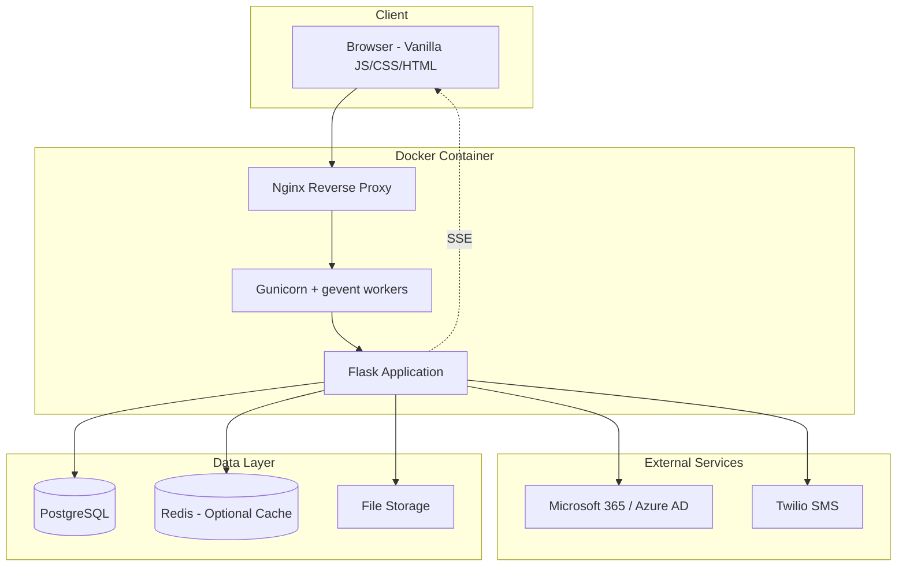
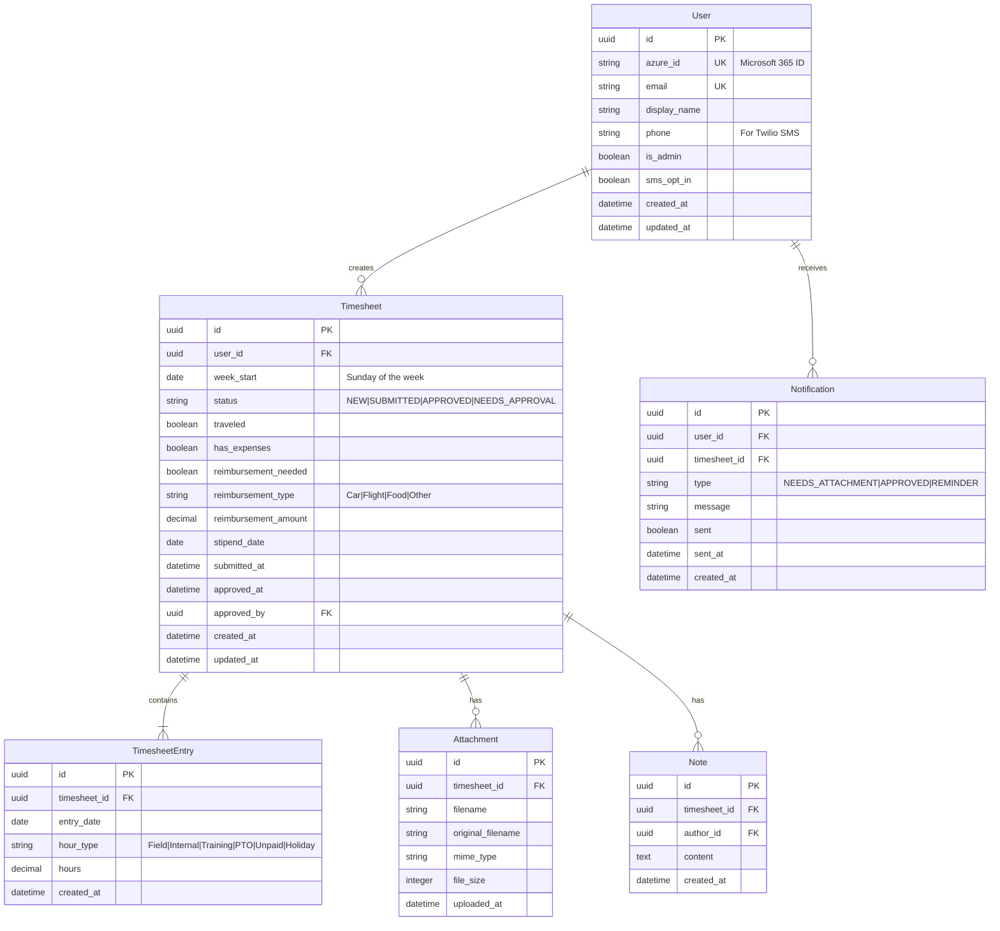
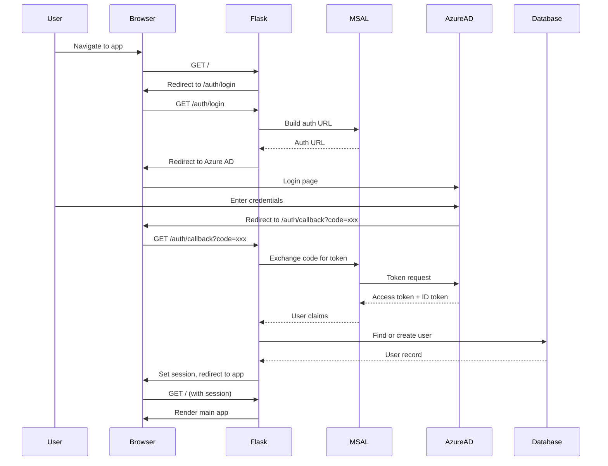
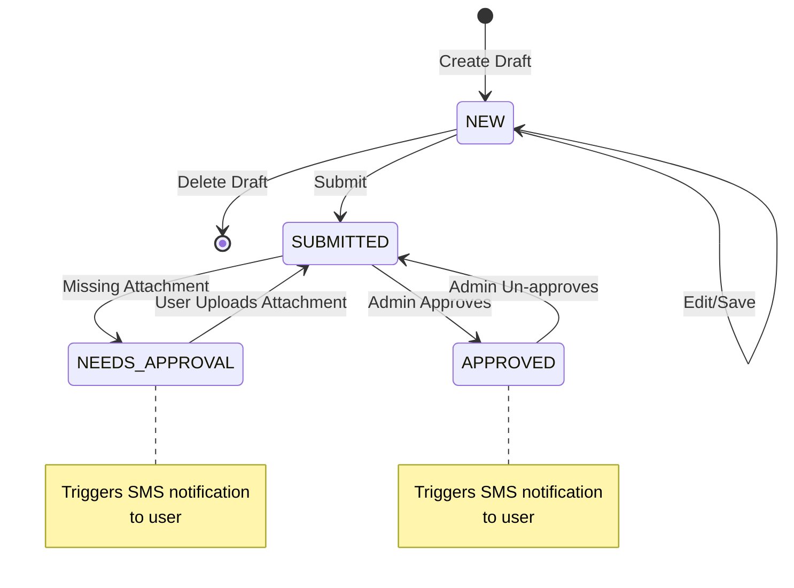

# Northstar Timesheet - Implementation Guide

Replacing the PowerApps timesheet solution with a modern Flask + vanilla JS/CSS application for ~60 users.

## Screenshots

### Reference: PowerApps Current UI


_Current PowerApps dashboard showing sidebar navigation, timesheet list, and star logo_


_PowerApps timesheet entry form with time grid and action buttons_

### New Implementation: Flask App


_New Flask implementation with forest green theme and premium UI_

---

## System Architecture



### Runtime Flow

In Docker, the request flow is:

1. `nginx` serves as reverse proxy and handles SSE-friendly proxy settings for `/api/events`.
2. `web` runs `gunicorn` with `gevent` workers and serves both API and static/template routes.
3. `db` is PostgreSQL (persistent volume).
4. `redis` supports SSE pub/sub (persistent volume).

---

## Database Schema



---

## API Endpoints

### Authentication

| Method | Endpoint         | Description                 |
| ------ | ---------------- | --------------------------- |
| GET    | `/auth/login`    | Redirect to Microsoft login |
| GET    | `/auth/callback` | OAuth callback handler      |
| POST   | `/auth/logout`   | End session                 |
| GET    | `/auth/me`       | Get current user info       |

### Timesheets (Regular User)

| Method | Endpoint                                 | Description                           |
| ------ | ---------------------------------------- | ------------------------------------- |
| GET    | `/api/timesheets`                        | List user's timesheets (with filters) |
| POST   | `/api/timesheets`                        | Create new draft timesheet            |
| GET    | `/api/timesheets/{id}`                   | Get timesheet with entries            |
| PUT    | `/api/timesheets/{id}`                   | Update draft timesheet                |
| DELETE | `/api/timesheets/{id}`                   | Delete draft timesheet                |
| POST   | `/api/timesheets/{id}/submit`            | Submit timesheet for approval         |
| POST   | `/api/timesheets/{id}/entries`           | Add/update time entries               |
| POST   | `/api/timesheets/{id}/attachments`       | Upload attachment                     |
| DELETE | `/api/timesheets/{id}/attachments/{aid}` | Remove attachment                     |
| POST   | `/api/timesheets/{id}/notes`             | Add note                              |

### Admin Endpoints

| Method | Endpoint                                       | Description                   |
| ------ | ---------------------------------------------- | ----------------------------- |
| GET    | `/api/admin/timesheets`                        | List all submitted timesheets |
| GET    | `/api/admin/timesheets/{id}`                   | Get timesheet details         |
| POST   | `/api/admin/timesheets/{id}/approve`           | Approve timesheet             |
| POST   | `/api/admin/timesheets/{id}/reject`            | Mark as needs approval        |
| POST   | `/api/admin/timesheets/{id}/unapprove`         | Revert approval               |
| GET    | `/api/admin/timesheets/{id}/attachments/{aid}` | Download attachment           |
| POST   | `/api/admin/timesheets/{id}/notes`             | Add admin note                |
| GET    | `/api/admin/users`                             | List all users                |

### Real-time Updates

| Method | Endpoint      | Description                      |
| ------ | ------------- | -------------------------------- |
| GET    | `/api/events` | SSE stream for real-time updates |

---

## File Structure

```
timesheet/
├── app/
│   ├── __init__.py              # App factory
│   ├── config.py                # Configuration classes
│   ├── extensions.py            # Flask extensions (db, migrate, etc.)
│   │
│   ├── models/
│   │   ├── __init__.py
│   │   ├── user.py              # User model
│   │   ├── timesheet.py         # Timesheet + Entry models
│   │   ├── attachment.py        # Attachment model
│   │   ├── note.py              # Note model
│   │   └── notification.py      # Notification model
│   │
│   ├── routes/
│   │   ├── __init__.py
│   │   ├── auth.py              # /auth/* endpoints
│   │   ├── timesheets.py        # /api/timesheets/* endpoints
│   │   ├── admin.py             # /api/admin/* endpoints
│   │   └── events.py            # /api/events SSE endpoint
│   │
│   └── utils/
│       ├── __init__.py
│       └── decorators.py        # @login_required, @admin_required
│
├── static/
│   ├── css/
│   │   ├── main.css             # Global styles
│   │   └── components.css       # Reusable components
│   │
│   ├── js/
│   │   ├── app.js               # Main application
│   │   ├── api.js               # API client wrapper
│   │   ├── timesheet.js         # Timesheet form logic
│   │   ├── admin.js             # Admin dashboard logic
│   │   └── sse.js               # Server-sent events handler
│   │
│   └── img/
│       └── logo.svg             # Northstar logo
│
├── templates/
│   ├── base.html                # Base template
│   ├── index.html               # Main app (SPA-style)
│   └── login.html               # Login page
│
├── docker/
│   ├── Dockerfile
│   ├── docker-compose.yml
│   └── nginx.conf
│
├── docs/
│   └── images/                  # Documentation images
│
├── uploads/                      # Local file storage
├── requirements.txt
├── .env.example
└── README.md
```

---

## Authentication Flow



**Dev Mode**: When Azure AD credentials are not configured, the app creates a local admin session automatically.

---

## Timesheet Workflow



---

## Hour Types & Business Logic

| Hour Type | Payable | Billable | Requires Attachment |
| --------- | ------- | -------- | ------------------- |
| Field     | ✅      | ✅       | ✅                  |
| Internal  | ✅      | ❌       | ❌                  |
| Training  | ❌      | ❌       | ❌                  |
| PTO       | ✅      | ❌       | ❌                  |
| Unpaid    | ❌      | ❌       | ❌                  |
| Holiday   | ✅      | ❌       | ❌                  |

---

## Configuration

Configuration is read from environment variables (also loaded from `.env` via `python-dotenv`).

Important env vars (see `.env.example` and `app/config.py`):

- `SECRET_KEY`
- `DATABASE_URL`
- `REDIS_URL`
- Azure AD (MSAL): `AZURE_CLIENT_ID`, `AZURE_CLIENT_SECRET`, `AZURE_TENANT_ID`, `AZURE_REDIRECT_URI`
- Twilio (optional): `TWILIO_ACCOUNT_SID`, `TWILIO_AUTH_TOKEN`, `TWILIO_PHONE_NUMBER`
- Uploads: `UPLOAD_FOLDER`, `MAX_CONTENT_LENGTH`

---

## Running the Application

### Docker (Recommended)

```bash
cd docker
docker-compose up --build
```

Access at: http://localhost

### Local venv

Requires local Postgres/Redis and env vars configured:

```bash
python3 -m venv .venv
source .venv/bin/activate
pip install -r requirements.txt
export FLASK_APP=app:create_app
flask run
```

---

## Code Quality

```bash
source .venv/bin/activate
black app
flake8 app
python -m compileall app
```

- `.flake8` is configured with `max-line-length = 88` to match Black

---

## Tasks

### Phase 2: Testing & Refinement

- [ ] **MSAL Authentication Integration**

  - [ ] Test Azure AD login flow end-to-end
  - [ ] Verify token refresh handling
  - [ ] Test logout and session cleanup
  - [ ] Confirm user creation/update on first login
  - [ ] See [AZURE.md](AZURE.md) for setup guide

- [ ] **Twilio SMS Notifications**

  - [ ] Implement `send_sms()` utility function
  - [ ] Test approval notification delivery
  - [ ] Test "needs attention" notification delivery
  - [ ] Add error handling and logging for failed SMS
  - [ ] See [TWILIO.md](TWILIO.md) for setup guide

- [ ] **Database Migrations**

  - [ ] Initialize Alembic: `flask db init`
  - [ ] Generate initial migration: `flask db migrate -m "Initial schema"`
  - [ ] Apply migration: `flask db upgrade`
  - [ ] Test migration rollback: `flask db downgrade`

- [ ] **Complete Workflow Testing**
  - [ ] Create new timesheet as regular user
  - [ ] Add time entries for full week
  - [ ] Upload attachment for field hours
  - [ ] Submit timesheet
  - [ ] Approve timesheet as admin
  - [ ] Verify SMS notification sent
  - [ ] Test "needs attachment" flow

### Phase 3: Integration Setup

- [ ] **Azure AD Configuration**

  - [ ] Create App Registration in Azure Portal
  - [ ] Configure redirect URIs for all environments
  - [ ] Create client secret
  - [ ] Grant admin consent for `User.Read` permission
  - [ ] Add credentials to `.env` file

- [ ] **Twilio Configuration**

  - [ ] Create Twilio account (or use existing)
  - [ ] Purchase SMS-capable phone number
  - [ ] Verify test phone numbers (if trial account)
  - [ ] Add credentials to `.env` file

- [ ] **User Onboarding**
  - [ ] Prepare list of ~60 users with emails
  - [ ] Identify admin users
  - [ ] Collect phone numbers for SMS opt-in (optional)

### Phase 4: Deployment

- [ ] **Pre-Deployment Checklist**

  - [ ] Set `SECRET_KEY` to a strong random value
  - [ ] Configure `DATABASE_URL` for production PostgreSQL
  - [ ] Set `AZURE_REDIRECT_URI` to production domain
  - [ ] Enable HTTPS (required for production OAuth)
  - [ ] Configure backup strategy for database

- [ ] **Docker Deployment**

  - [ ] Build production images: `docker-compose build`
  - [ ] Start services: `docker-compose up -d`
  - [ ] Run migrations: `docker-compose exec web flask db upgrade`
  - [ ] Verify application loads at production URL
  - [ ] Test authentication flow

- [ ] **Post-Deployment Verification**
  - [ ] Admin can log in and view submitted timesheets
  - [ ] Regular user can create and submit timesheet
  - [ ] File uploads work correctly
  - [ ] SMS notifications are delivered
  - [ ] SSE real-time updates function

### Phase 5: Production Hardening (Optional)

- [ ] **Monitoring & Logging**

  - [ ] Configure centralized logging (e.g., ELK, CloudWatch)
  - [ ] Set up uptime monitoring
  - [ ] Configure error alerting (e.g., Sentry)

- [ ] **Performance**

  - [ ] Enable Redis caching for sessions
  - [ ] Configure CDN for static assets
  - [ ] Load test with expected user count

- [ ] **Security Audit**
  - [ ] Review OWASP Top 10 checklist
  - [ ] Scan for dependency vulnerabilities
  - [ ] Verify CORS and CSP headers

---

## Open Questions

1. **File Storage**: Local vs. cloud - currently using local filesystem. Consider S3/Azure Blob for production?
2. **Field Hours Document**: What specific document is uploaded? Client sign-off sheet?
3. **Reporting**: Any export requirements (CSV, PDF reports)?
4. **Historical Data**: Need to migrate existing PowerApps data?
5. **Backup Strategy**: How frequently should database be backed up? Daily recommended.
6. **Domain**: What will be the production URL for the application?
7. **SSL Certificate**: Self-managed or automated (Let's Encrypt)?
