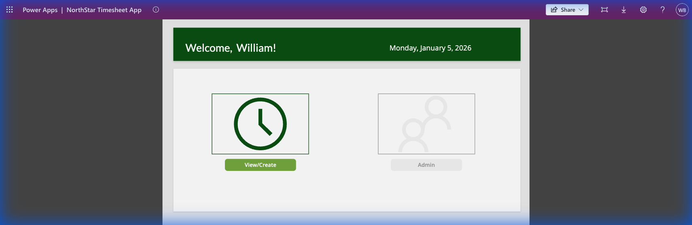
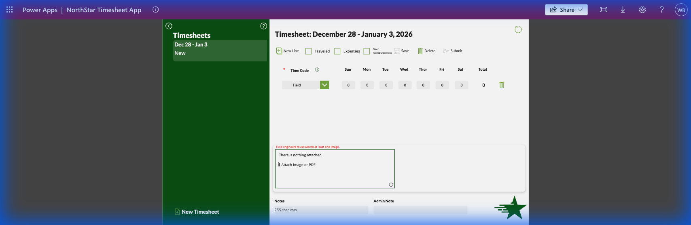
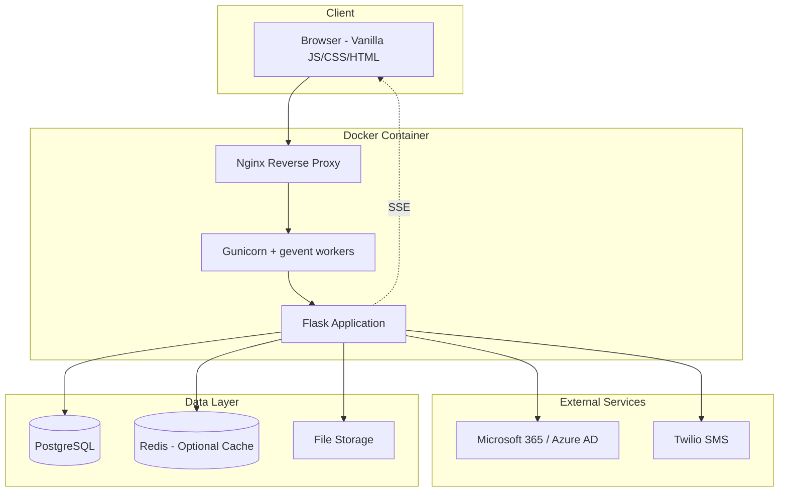
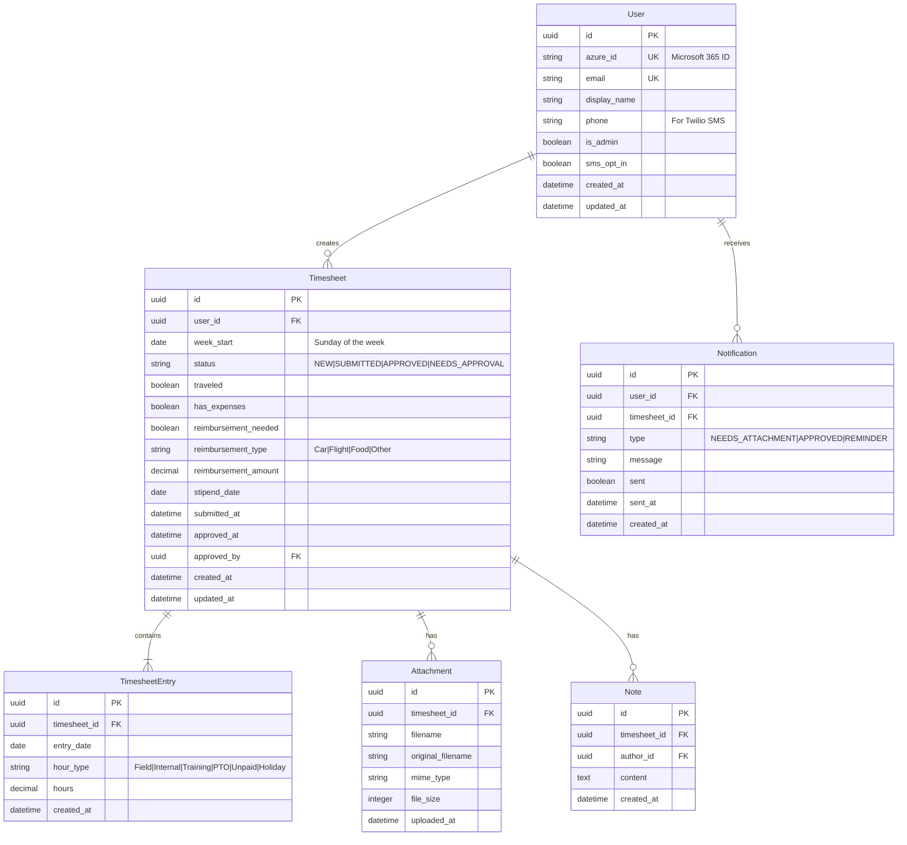
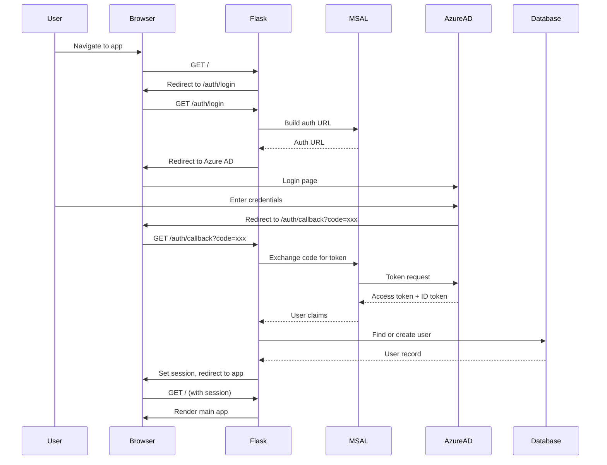
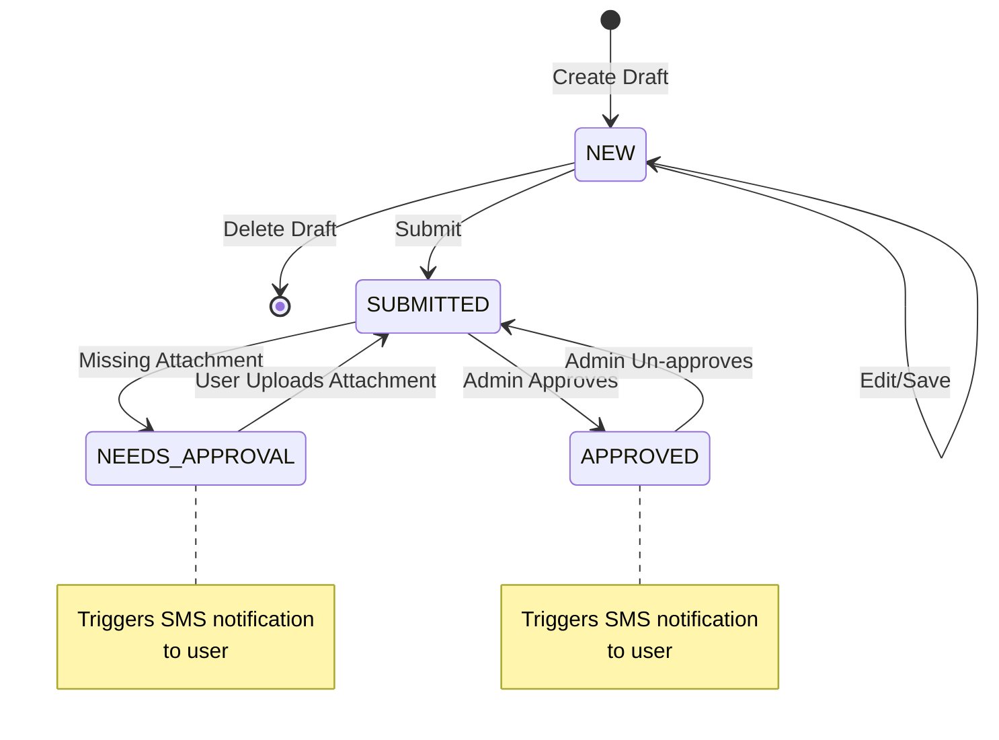

# Timesheet Application - Implementation Plan

Replacing the PowerApps timesheet solution with a modern Flask + vanilla JS/CSS application for ~60 users.

## Screenshots

### Reference: PowerApps Current UI


_Current PowerApps dashboard showing sidebar navigation, timesheet list, and star logo_


_PowerApps timesheet entry form with time grid and action buttons_

### New Implementation: Flask App


_New Flask implementation with forest green theme and premium UI_

---

## System Architecture



## User Review Required

> [!IMPORTANT] > **File Storage Decision Pending**: Attachment storage (images/PDFs for field hours) needs to be decided. Options:
>
> - Local filesystem (Docker volume) - simpler, but requires backup strategy
> - Azure Blob Storage - scales better, integrates with O365
>
> For initial implementation, we'll use local filesystem with a clear abstraction layer to swap later.

> [!IMPORTANT] > **Field Hours Approval Document**: The purpose/format of the uploaded document for field hours needs clarification. Currently implementing as a generic file upload.

---

## Database Schema



---

## API Endpoints

### Authentication

| Method | Endpoint         | Description                 |
| ------ | ---------------- | --------------------------- |
| GET    | `/auth/login`    | Redirect to Microsoft login |
| GET    | `/auth/callback` | OAuth callback handler      |
| POST   | `/auth/logout`   | End session                 |
| GET    | `/api/me`        | Get current user info       |

### Timesheets (Regular User)

| Method | Endpoint                                 | Description                           |
| ------ | ---------------------------------------- | ------------------------------------- |
| GET    | `/api/timesheets`                        | List user's timesheets (with filters) |
| POST   | `/api/timesheets`                        | Create new draft timesheet            |
| GET    | `/api/timesheets/{id}`                   | Get timesheet with entries            |
| PUT    | `/api/timesheets/{id}`                   | Update draft timesheet                |
| DELETE | `/api/timesheets/{id}`                   | Delete draft timesheet                |
| POST   | `/api/timesheets/{id}/submit`            | Submit timesheet for approval         |
| POST   | `/api/timesheets/{id}/entries`           | Add/update time entries               |
| POST   | `/api/timesheets/{id}/attachments`       | Upload attachment                     |
| DELETE | `/api/timesheets/{id}/attachments/{aid}` | Remove attachment                     |
| POST   | `/api/timesheets/{id}/notes`             | Add note                              |

### Admin Endpoints

| Method | Endpoint                                       | Description                   |
| ------ | ---------------------------------------------- | ----------------------------- |
| GET    | `/api/admin/timesheets`                        | List all submitted timesheets |
| GET    | `/api/admin/timesheets/{id}`                   | Get timesheet details         |
| POST   | `/api/admin/timesheets/{id}/approve`           | Approve timesheet             |
| POST   | `/api/admin/timesheets/{id}/reject`            | Mark as needs approval        |
| POST   | `/api/admin/timesheets/{id}/unapprove`         | Revert approval               |
| GET    | `/api/admin/timesheets/{id}/attachments/{aid}` | Download attachment           |
| POST   | `/api/admin/timesheets/{id}/notes`             | Add admin note                |
| GET    | `/api/admin/users`                             | List all users                |

### Real-time Updates

| Method | Endpoint      | Description                      |
| ------ | ------------- | -------------------------------- |
| GET    | `/api/events` | SSE stream for real-time updates |

---

## File Structure

```
timesheet/
├── app/
│   ├── __init__.py              # App factory
│   ├── config.py                # Configuration classes
│   ├── extensions.py            # Flask extensions (db, migrate, etc.)
│   │
│   ├── models/
│   │   ├── __init__.py
│   │   ├── user.py              # User model
│   │   ├── timesheet.py         # Timesheet + Entry models
│   │   ├── attachment.py        # Attachment model
│   │   ├── note.py              # Note model
│   │   └── notification.py      # Notification model
│   │
│   ├── routes/
│   │   ├── __init__.py
│   │   ├── auth.py              # /auth/* endpoints
│   │   ├── timesheets.py        # /api/timesheets/* endpoints
│   │   ├── admin.py             # /api/admin/* endpoints
│   │   └── events.py            # /api/events SSE endpoint
│   │
│   ├── services/
│   │   ├── __init__.py
│   │   ├── timesheet_service.py # Business logic for timesheets
│   │   ├── auth_service.py      # MSAL authentication logic
│   │   ├── notification_service.py # Twilio + notification logic
│   │   └── storage_service.py   # File upload/download abstraction
│   │
│   └── utils/
│       ├── __init__.py
│       ├── decorators.py        # @login_required, @admin_required
│       └── validators.py        # Input validation helpers
│
├── static/
│   ├── css/
│   │   ├── main.css             # Global styles
│   │   ├── components.css       # Reusable components
│   │   └── admin.css            # Admin-specific styles
│   │
│   ├── js/
│   │   ├── app.js               # Main application
│   │   ├── api.js               # API client wrapper
│   │   ├── auth.js              # Authentication handling
│   │   ├── timesheet.js         # Timesheet form logic
│   │   ├── admin.js             # Admin dashboard logic
│   │   └── sse.js               # Server-sent events handler
│   │
│   └── img/
│       └── logo.svg             # Northstar logo
│
├── templates/
│   ├── base.html                # Base template
│   ├── index.html               # Main app (SPA-style)
│   ├── login.html               # Login page
│   └── error.html               # Error pages
│
├── tests/
│   ├── conftest.py              # Test fixtures
│   ├── test_models.py
│   ├── test_timesheets.py
│   └── test_admin.py
│
├── docker/
│   ├── Dockerfile
│   ├── docker-compose.yml
│   └── nginx.conf
│
├── docs/
│   └── images/                  # Documentation images
│
├── migrations/                   # Alembic migrations
├── uploads/                      # Local file storage
│   └── .gitkeep
├── requirements.txt
├── requirements-dev.txt
├── .env.example
├── .gitignore
├── README.md
└── IMPLEMENTATION.md
```

---

## Authentication Flow



---

## Timesheet Workflow



---

## Hour Types & Business Logic

| Hour Type | Payable | Billable | Requires Attachment |
| --------- | ------- | -------- | ------------------- |
| Field     | ✅      | ✅       | ✅                  |
| Internal  | ✅      | ❌       | ❌                  |
| Training  | ❌      | ❌       | ❌                  |
| PTO       | ✅      | ❌       | ❌                  |
| Unpaid    | ❌      | ❌       | ❌                  |
| Holiday   | ✅      | ❌       | ❌                  |

---

## Development Phases

### Phase 1: Foundation ✅ (Complete)

- [x] Docker setup with Nginx + Gunicorn
- [x] Flask app factory with blueprints
- [x] PostgreSQL models with SQLAlchemy
- [x] MSAL authentication integration (with dev bypass)
- [x] Basic HTML templates and CSS

### Phase 2: Core Features (In Progress)

- [x] Timesheet CRUD API endpoints
- [x] Time entry management
- [x] Draft/Submit workflow
- [x] File upload for attachments
- [ ] JavaScript frontend for timesheet form (needs completion)

### Phase 3: Admin Features

- [x] Admin dashboard API
- [x] Approval workflow
- [ ] Filtering and reporting UI
- [x] Admin notes

### Phase 4: Notifications & Polish

- [ ] Twilio SMS integration
- [x] SSE real-time updates (basic)
- [ ] Weekly reminder job
- [ ] Auto-populate feature
- [ ] Tooltips and UX refinements

---

## Running the Application

### Docker (Recommended)

```bash
cd docker
docker compose up --build -d
```

Access at: http://localhost

### Development Mode

The app has a development bypass when Azure AD credentials are not configured. It creates a test user with admin access automatically.

---

## Open Questions

1. **File Storage**: Local vs. cloud - to be decided after initial prototype
2. **Field Hours Document**: What specific document is uploaded? Client sign-off sheet?
3. **Reporting**: Any export requirements (CSV, PDF reports)?
4. **Historical Data**: Need to migrate existing PowerApps data?
5. **Backup Strategy**: How frequently should database be backed up?
